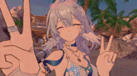

  
  
  <h1>Hi there, I'm Phntme! 👋</h1>
  <i>"Welcome to my world~ 🕊️"</i>
    

  
    

  
<b>Digital Generalist 🎨 | Vanilla Frontend Survivor ➔ Godot Explorer 🎮</b>

  
Informatics student at <b>Universitas Negeri Semarang (UNNES)</b>. Building worlds, learning GDScript, and centering divs.

   

  <h3>🛠️ Arsenal & Tools</h3>
  
  
<b>🌐 Web Development</b>

  
  
    
  
<b>🎮 Game Development</b>

  
  
    
  
<b>🎨 Design & Video</b>

  
Affinity, Alight Motion, Capcut, Kinemaster

    
 

  <h3>📊 My Progress Stats</h3>
  
<i>Powered by Yoasobi, and eggs 🍳.</i>

  
   

    
 
   

